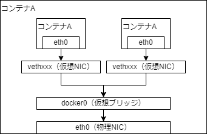

## Docker Desktop導入方法
1. 以下リンクを開く。 
    - [Docker Hub](https://hub.docker.com/)
1. 開いたページの右上のリンク先から`Docker Desktop`へ遷移。 
1. インストーラをダウンロードし実行。 

## Dockerとは
コンテナ型仮想環境でアプリケーションを管理・実行するためのオープンソースのプラットフォーム

## Dockerを使う上で重要な考え方
### Immutable Infrastructure
本番環境に手を加えないこと。環境が汚れず、きれいな状態を維持できる。変更履歴が残らないため、トラブルの原因特定が容易になる。実現方法にIaCなどがある。

### Infrastructure as Code
インフラ構築をコード化すること。インフラ構築が素早くなる点や、構成要素の管理をコードの管理だけで済むメリットがある。

### PID1
本来Linuxディストリビューションではinit（PID1）でプロセス（デーモン）の起動などを管理する。 
コンテナでは原則1コンテナ1アプリケーションであるため、initは用いず、直接起動する。 
直接起動しているため、そのプロセスが終了すると、コンテナ自体も終了する。 
結論、PID1でアプリケーションを動かし続ける必要がある。 
 

## Dockerの基本機能
### Build
Dockerイメージを作成すること。基本1つのイメージには、1つのアプリケーションのみを入れる。複数組み合わせることでサービスを構築する。
Dockerコマンドを使用すると、Dockerイメージをtarファイルに出力が可能である。
DockerイメージはDockerfleという設定ファイルを用いて、自動でイメージを作成できる。
また、Dockerイメージは積み重ねることができ、OSのイメージにWebアプリケーションのイメージを積み重ねるといった使い方が可能である。

### Ship
DockerイメージはDockerレジストリで共有できる。Docker Hubは公式のDockerレジストリであり、CentOSやUbuntuなどのベースイメージがある。また、Docker Hubには個人で作成したイメージを自由に公開できる。DockerコマンドでDocker Hubにログインが可能。
Docker HubはGitHubやBitbucketと連携することができる。GitHubでDockerfileを管理し、Dockerイメージを自動生成したのち、Docker Hubで公開するといったことができる。この自動生成する機能をAutomated Buildとよぶ。

### Run
DockerはLinux上でコンテナ単位でサーバ機能を動作させる。DockerコンテナのもとになるDockerイメージがあり、Dockerがインストールされた環境であれば、どこでもDockerコンテナを動作させることが可能。また、Dockerイメージから複数のDockerコンテナを起動することも可能である。Dockerコンテナの起動/停止/破棄はDockerのコマンドを使用する。仮想マシンと違い、Dockerはすでに動いているOS上で動作するプロセスと同等の速度で起動する。
DockerはLinuxのカーネル機能を使い、Dockerコンテナを独立した空間として管理することができる。また、プロダクション環境では、分散環境であることが多く、オーケストレーションツールを使うことが一般的である。

## Dockerのエディション
Dockerには無償版（Docker Community Edition）と有償版（Docker Enterprise Edition）がある。また、サーバ向けOS、パブリッククラウド、クライアント向けOSに対応している。Docker CEではサーバ向けOSにCentOSも含まれる。
Dockerのバージョンは「年2桁.月2桁」となっている。四半期ごとにDocker CEの安定板であるStableがリリースされる。Docker EEはDocker CEのStableと同じタイミングでリリースされる。

## Dockerのコンポーネント
### Docker Engine（Dockerのコア機能）
Dockerイメージの生成やDockerコンテナの起動を行う。Dockerコマンドの実行や、Dockerfileによるイメージ作成も行う。

### Docker Registry（イメージ公開/共有）
Dockerイメージを公開/共有するためのレジストリ機能。Docker Hubもこの機能を利用している。

### Docker Compose（複数コンテナ一元管理）
複数コンテナの構成情報をコード定義し、コマンドを実行することでアプリケーション実行環境を構成するコンテナ群を一元管理するためのツール。

### Docker Machine（Docker実行環境構築）
Dockerの実行環境をコマンドで自動生成するためのツール。

### Docker Swarm（クラスタ管理）
Docker Swarmは複数のDockerホストをクラスタ化するためのツール。クラスタとは複数サーバを外から見たとき1台のサーバと見せる技術のこと、分散管理のこと。クラスタの管理やAPIの提供を行うManagerと、Dockerコンテナを実行するNodeがある。また、オープンソースのKubernetesも利用可能。

## コンテナを区画化する仕組み
DockerではDockerコンテナを区画化するためにLinuxカーネルのnamespace機能を用いている。 

Linuxでのnamespaceには下記がある。
- PID namespace：プロセスID
- Network namespace：ネットワーク
- UID namespace：ユーザやグループ
- MOUNT namespace：マウント
- UTS namespace：ホスト名やドメイン
- IPC namespace：プロセス間通信オブジェクト
    - 共有メモリやセマフォ/メッセージキューのことである。

## リソース管理の仕組み（cgroups）
Dockerでは、物理マシン上のリソースを複数のコンテナで共有して動作する。リソースの管理はLinuxカーネルの機能である「control groups」が利用される。 
Linuxではプログラムを、1つ以上のスレッドの塊であるプロセスとして動作する。cgroupsでコンテナ内のプロセスにリソース制限をかけ、ほかコンテナへの影響を防ぐ。 
cgroupsでは階層構造を使ってプロセスをグループ化管理できる。任意の階層がCPU50%使える状態で、その下位階層の2プロセスがそれぞれ30%と制限されているとする。その場合、下位階層2プロセスの合計CPU利用率が、50%を超えることはない。

## ネットワーク構成（仮想ブリッジ/仮想NIC）
まず、イメージ図を示す。 

Dockerコンテナを起動すると、コンテナに172.17.0.0/16のプライベートIPアドレスがeth0に自動的に割り当てられる。また、仮想NICはコンテナ側からはeth0と見える。 
仮想ブリッジと物理NIC間で、NAPT技術が利用されることで外部ネットワークへ接続が可能になる。

## Dockerイメージのデータ管理の仕組み
コピーを要求してもすぐにコピーせず、元のデータを参照させ、どちらかを変更しようとしたタイミングで初めて空き領域を確保しコピーする仕組みを「Copy on Write」と呼ぶ。DockerではCopy on Write方式でDockerコンテナのイメージの差分を扱う。Dockerのイメージを管理するストレージデバイスには以下のようなものがある。
- AUFS
- Btrfs
- Device Mapper
- OverlayFS
- ZFS

## その他
### Moby Project
コンテナ技術をベースにしたコンポーネントの組み合わせで、システム構築ができることを目指すオープンソースプロジェクト。動向を知っておくといいかも...。

### Docker desktop for Windowsについて
Docker dektop for WindowsはHyper-Vの機能を用いて、LinuxのVMを作成し、その中にDockerコンテナを作る。しかし、利用者はそれを意識せず、Windowsから直接Dockerコンテナを触っているように自覚できる。 
Linuxに直接入れるDocker以外は、すべてこの構成になっている。Macの場合はDocker desktop for Macでそれ以外はDocker Toolboxを利用する。Macとそれ以外にはHyper-Vがないため、それぞれ専用のVMソフトが用いられる。Docker Toolboxの場合はVirtual Boxである。 
またWindowsにはWSL2というLinuxをWindowsで直接動かしてる風にできる仕組みがある。WSL2の実際の動きはHyper-VでLinuxのVMを作成し、それを制御している。Docker desktop for WindowsでWSL2を利用することも可能。利用しなくても構成は似ている。 

# 備考
- プログラマのためのDocker教科書第2版