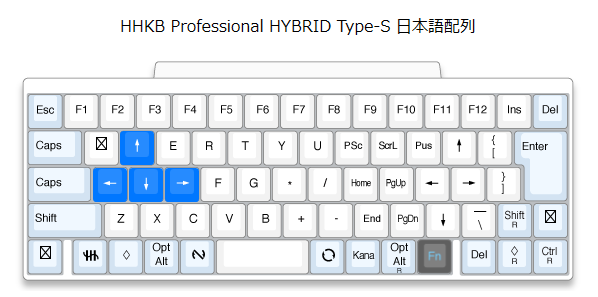

# 使用デバイス
* HHKB Professional Hybrid Type-S
* Shokz OpenRun
* Logicool M325S
* Logicool G703h
* Anker 4-Port Ultra-Slim USB-A (USB3.0対応) ハブ
* tp-link UB500 Bluetooth 5.3 ナノUSBアダプター

# PCへの接続方法
* AnkerのUSBハブにtp-linkのBluetoothアダプターとLogicool M325Sのアダプターを接続
* HHKBとShokzをBluetoothで接続

# Bluetoothアダプター使用時の注意点
* Windowsの場合、デバイスマネージャーから既存のBluetoothデバイスを無効化すること
* [ドライバー](https://www.tp-link.com/jp/support/download/)が必要な場合ダウンロードすること

# HHKB設定
DIPスイッチは2のみオン  
  
  

# Shokz操作
* 電源のオンオフ
    * 音量`+`ボタン長押し
* ペアリングモード開始
    * 音量`+`ボタンさらに長押し
* マルチポイントペアリング開始
    * ペアリングモードで音量`+`ボタンとマルチファンクションボタン長押し
* マルチペアリングモードの終了
    * ペアリングモードで音量`-`ボタンとマルチファンクションボタン長押し
* 再生/一時停止/応答
    * マルチファンクションボタン1回
* 次へ
    * マルチファンクションボタン2回
* 前へ
    * マルチファンクションボタン3回
