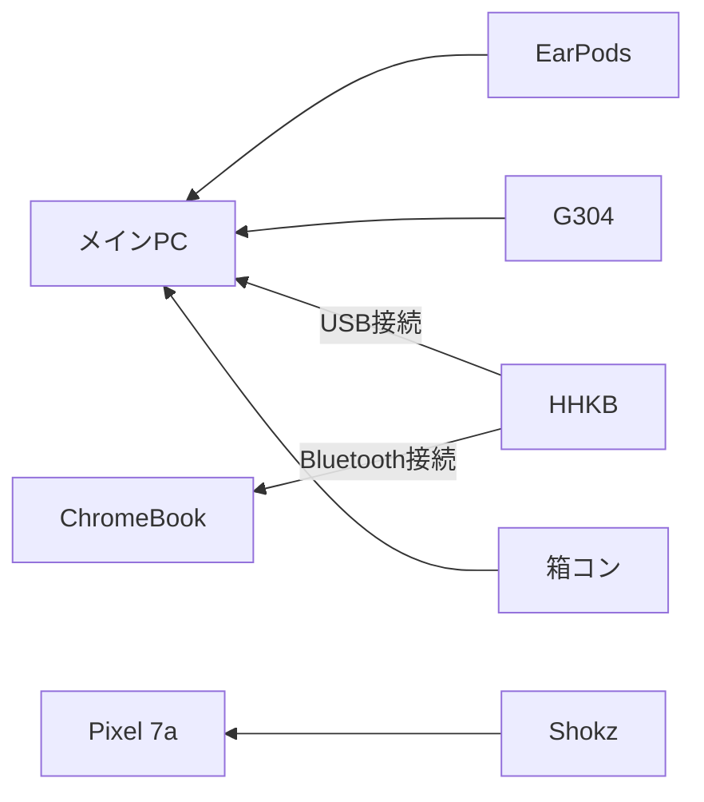
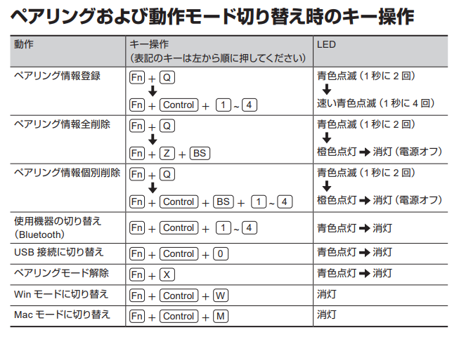
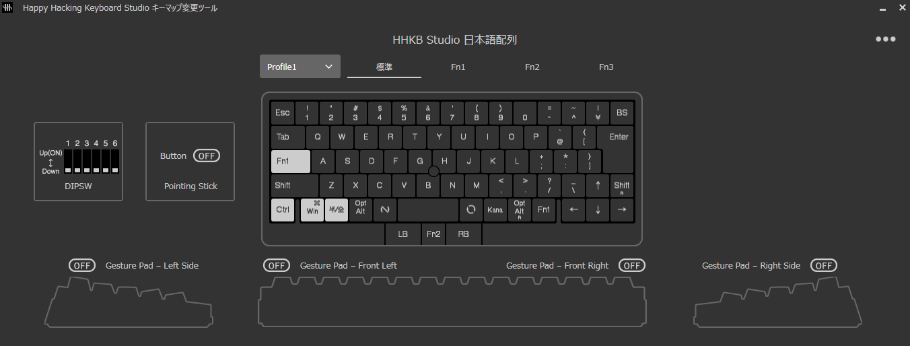
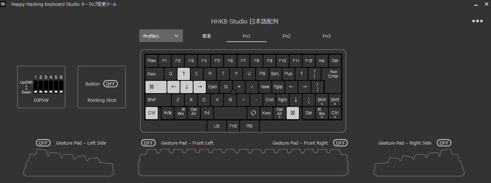
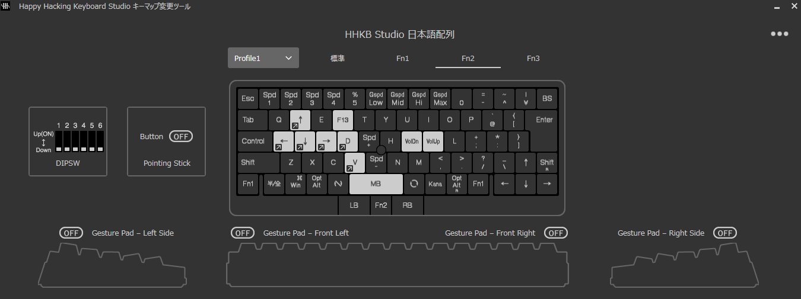

# 周辺デバイス
* ~~HHKB Professional Hybrid Type-S~~
* HHKB Studio
* USB接続ケーブル(TypeC - A L字)
* 打ち箸
* Shokz OpenRun
* EarPods 3.5mm
* Logicool G304
* Xbox 純正コントローラー
* ~~Anker 4-Port Ultra-Slim USB-A (USB3.0対応) ハブ~~
* PC
* ChromeBook
* Google Pixel 7a

## 接続図

## HHKB設定
### Professional Hybrid Type-S
DIPスイッチは2のみオン  
  
  

### Studio
  
  

#### 英数キーとかなキー
かなキーがLang1キーで英数キーがLang2キーとなっている。  
WindowsのIMEではLang1がIMEオン、Lang2がIMEオフとなっている。  
TODO: ChromeBookでは上記の設定になっていない。対応が必要。

##### 参考
https://learn.microsoft.com/ja-jp/windows-hardware/design/component-guidelines/keyboard-japan-ime

#### F2レイヤー
* WASD
    * `Win + ← or ↓ or ↑ or →`に設定
    * 画面の分割や最大化を行いやすくするため
* F13キーの追加
    * OBSのリプレイバッファに割り当てている
* V
    * `Win + Ctrl + v`で音量ミキサーを開けるようにしている
* F
    * `Win + Shift + d`でPowerToysのマウスジャンプを起動する

#### tips
* USB接続に切り替え：`Fn1 + Ctrl + 0`
    * LEDインジケータ―全体が青く光る
* Bluetooth接続に切り替え：`Fn1 + Ctrl + 1~4`
* カーソルの移動速度を変更：`Fn2 + 1~4`
    * LEDインジケーターが`1~4`の対応する位置で光る
    * `2`か`3`がちょうどいい
* プロファイルの切り替え：`Fn1 + c` → `1~4`
    * LEDインジケーターが`1~4`の対応する位置で光る
* ペアリングモードに切り替え：`Fn1 + q`
    * ペアリング番号を指定：`Fn1 + Ctrl + 1~4`
* ペアリングモードを解除：`Fn1 + x`
* すべてのペアリングを解除：`Fn1 + z + delete`

## Shokz操作
* 電源のオンオフ
    * 音量`+`ボタン長押し
* ペアリングモード開始
    * 音量`+`ボタンさらに長押し
* マルチポイントペアリング開始
    * ペアリングモードで音量`+`ボタンとマルチファンクションボタン長押し
* マルチペアリングモードの終了
    * ペアリングモードで音量`-`ボタンとマルチファンクションボタン長押し
* 再生/一時停止/応答
    * マルチファンクションボタン1回
* 次へ
    * マルチファンクションボタン2回
* 前へ
    * マルチファンクションボタン3回
