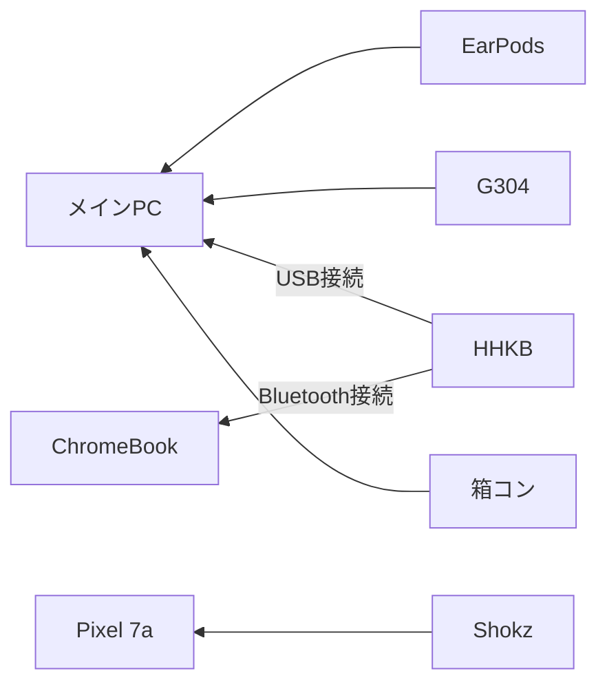
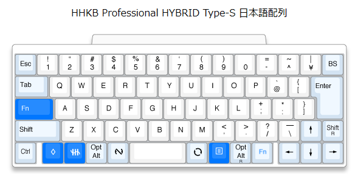
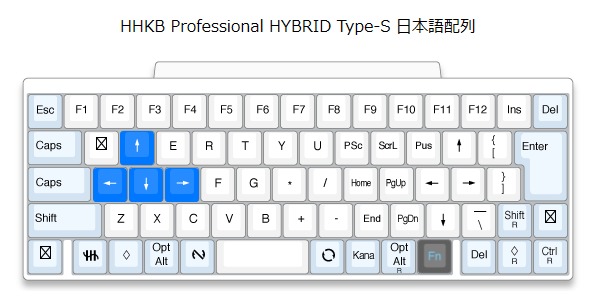
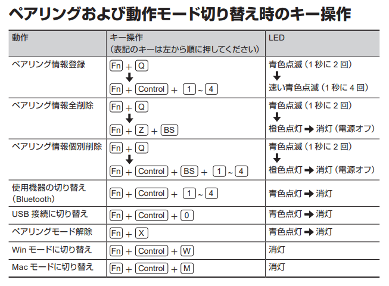
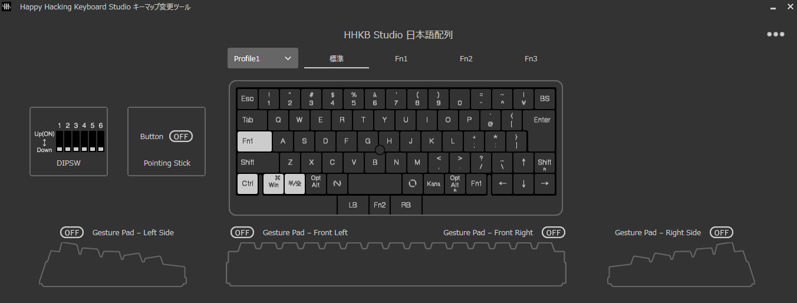
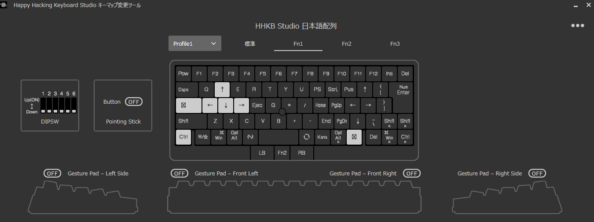
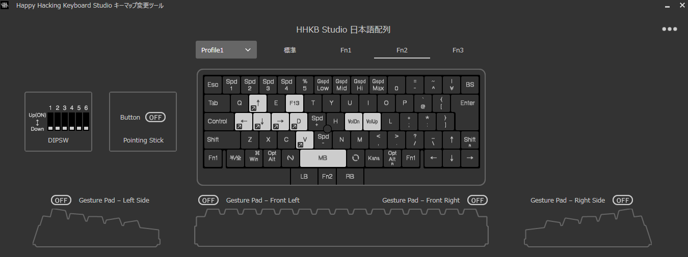

## 接続図

```mermaid
graph RL
    pc[メインPC]
    chromebook[ChromeBook]
    pixel[Pixel 7a]
    hhkb[HHKB]
    shokz[Shokz]
    earpods[EarPods]
    g304[G304]
    xbox[箱コン]

    earpods --> pc
    hhkb -->|USB接続| pc
    g304 --> pc
    xbox --> pc

    shokz --> pixel
    hhkb -->|Bluetooth接続| chromebook
```

## HHKB設定
### Professional Hybrid Type-S
DIPスイッチは2のみオン  
  
  

### Studio
  
  

#### IMEのオンオフ
キーマップ変更ツールでかな／英数キーを割り当てることでLang1／Lang2を割り当てることができる。  
[WindowsのIME](https://learn.microsoft.com/ja-jp/windows-hardware/design/component-guidelines/keyboard-japan-ime)ではLang1がIMEオン、Lang2がIMEオフとなっている。

#### F2レイヤー
* WASD
    * `Win + ← or ↓ or ↑ or →`に設定
    * 画面の分割や最大化を行いやすくするため
* F13キーの追加
    * OBSのリプレイバッファに割り当てている
* V
    * `Win + Ctrl + v`で音量ミキサーを開けるようにしている
* F
    * `Win + Shift + d`でPowerToysのマウスジャンプを起動する

