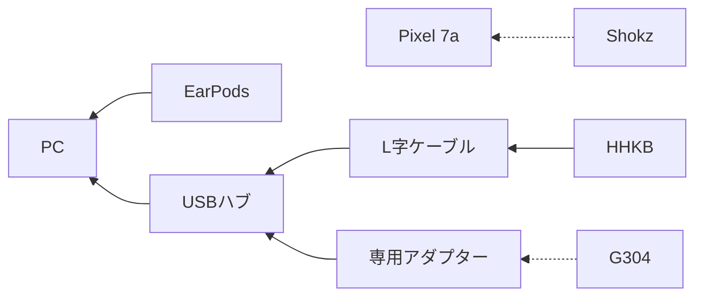

# 周辺デバイス
* HHKB Professional Hybrid Type-S
* USB接続ケーブル(TypeC - A L字)
* 打ち箸
* Shokz OpenRun
* EarPods 3.5mm
* Logicool G304
* Anker 4-Port Ultra-Slim USB-A (USB3.0対応) ハブ
* PC
* Google Pixel 7a

## 接続図

## HHKB設定
DIPスイッチは2のみオン  
  
  

## Shokz操作
* 電源のオンオフ
    * 音量`+`ボタン長押し
* ペアリングモード開始
    * 音量`+`ボタンさらに長押し
* マルチポイントペアリング開始
    * ペアリングモードで音量`+`ボタンとマルチファンクションボタン長押し
* マルチペアリングモードの終了
    * ペアリングモードで音量`-`ボタンとマルチファンクションボタン長押し
* 再生/一時停止/応答
    * マルチファンクションボタン1回
* 次へ
    * マルチファンクションボタン2回
* 前へ
    * マルチファンクションボタン3回
