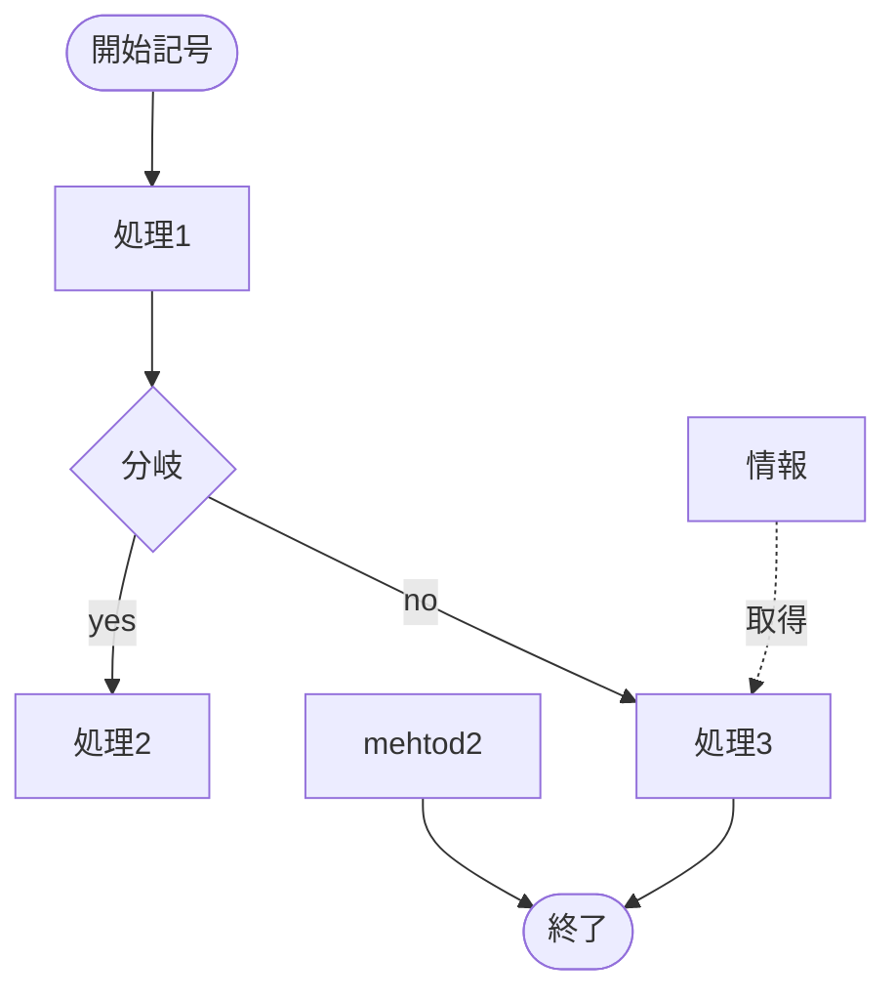

# 設計書
* 設計書からテストが作成できるように書く
* 基本設計では画面名や機能名を使い説明する
* Webアプリの場合以下の見出しを作ると書きやすい
    * 画面表示（画面項目）
    * 画面制御（イベント）
    * サーバーサイド処理
        * 成功
        * 失敗
        * 例外

# テストケース
* 前提・操作・期待値を明確にする
* 設計書の見出しごとにケースを作る

# mermaid
