## Git for Windowsアンインストール手順
1. `コントロールパネル -> プログラムと機能`から`Git`をアンインストールする
1. 下記ディレクトリを削除する
    - `C:\Program Files\Git`
    - `C:\Users\(ユーザ名)\.gitconfig`

## Git for Windowsインストール手順
1. 以下からインストーラをダウンロードし実行する
    - [Git for Windows公式](https://gitforwindows.org/)<br>
1. インストール先を設定する
    - 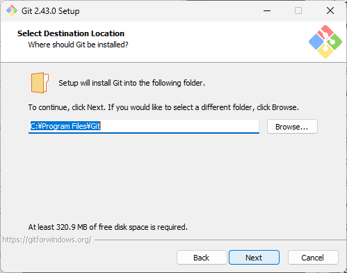<br>
1. コンポーネントは`Git LFS`のみチェックする
    - 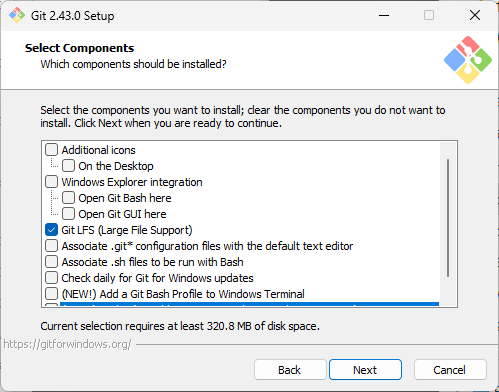<br>
1. スタートメニューでの表示名を設定する
    - 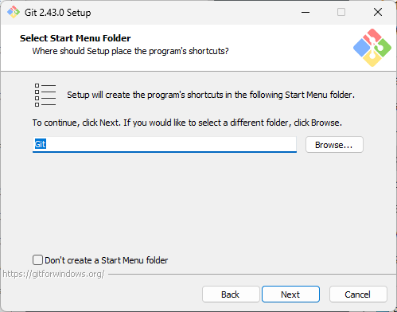<br>
1. エディターはデフォルトで進む
    - <br>
1. 初期ブランチ名もデフォルトで進む
    - <br>
1. 環境変数は`Use Git from Git Bash only`を選択する
    - <br>
1. SSHサーバは`Use external OpenSSH`を選択する
    - 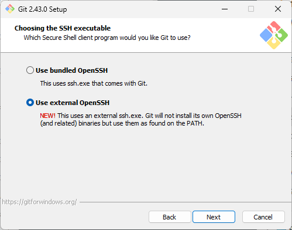<br>
1. `Use the OpenSSL library`を選択する
    - 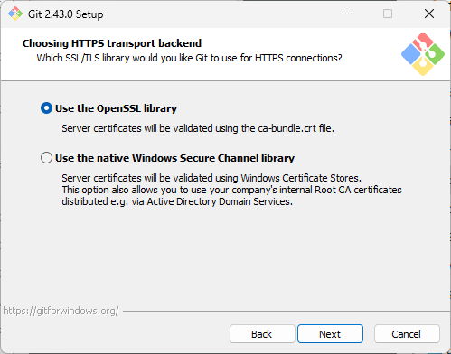<br>
1. 改行コード変換は`Checkout as-is, commit as-is`を選択する
    - <br>
1. `Use MinTTY`を選択する
    - 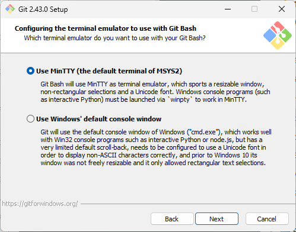<br>
1. `Fast-forward or merge`を選択する
    - 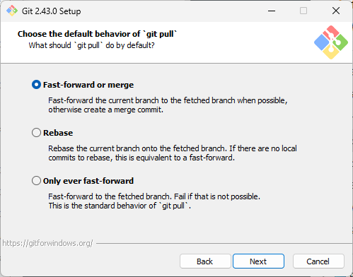<br>
1. `Git Credential Manager`を選択する
    - 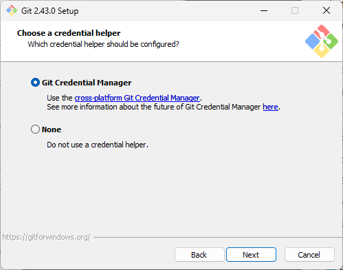<br>
1. 初期設定のまま進む
    - 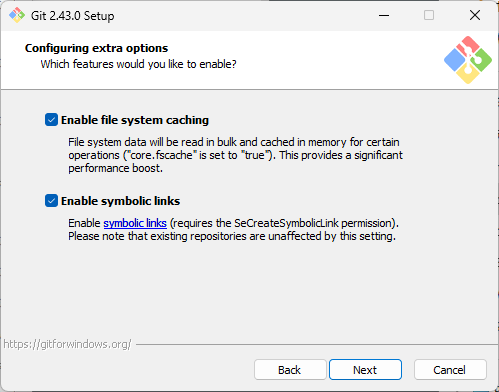<br>
1. 初期設定のまま進む
    - 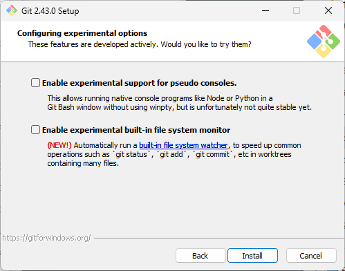<br>
1. インストール後、`Git Bash`で[git config](#git-config)を実行する

#### git config
```
git config --global user.name "GIT_USER_NAME"
git config --global user.email "GIT_USER_EMAIL"
git config --global core.autocrlf false
git config --global core.ignorecase false
git config --global core.quotepath false
git config --global pull.rebase false
```

## TortoiseGitアンインストール手順
1. `コントロールパネル -> プログラムと機能`から`TortoiseGit`をアンインストールする

## TortoiseGitインストール手順
1. 以下からインストーラをダウンロードし実行する
    - [TortoiseGit公式](https://tortoisegit.org/download/)
1. すべてデフォルトのままインストールする
1. 何もないところで右クリックし、`TortoiseGit -> Setting`を開く
1. `Network -> SSH`を以下のように設定する
    - 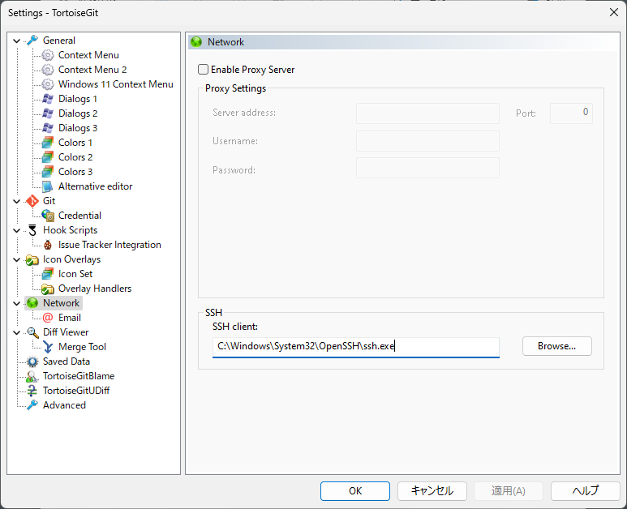

## SSH鍵の設定
1. コマンドプロンプトで`ssh-keygen`を実行する
1. `C:\Users\(ユーザ名)\.ssh\id_rsa.pub`の中身をすべてコピーする
1. `GitHub`のユーザ設定でSSHKey（Authentication）を登録する