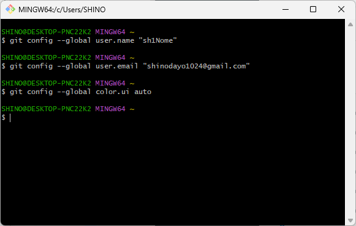

## Git for Windowsアンインストール手順
1. `コントロールパネル -> プログラムと機能`から`Git`をアンインストールする。
1. 下記ディレクトリを削除する。
    - `C:\Program Files\Git`
    - `C:\Users\(ユーザ名)\.gitconfig`

## Git for Windowsインストール手順
1. 以下からインストーラをダウンロードし実行する。
    - [Git for Windows公式](https://gitforwindows.org/) 
1. インストール先を設定。
    -  
1. コンポーネントは`Git LFS`のみ必要。
    -  
1. スタートメニューでの表示名を設定。
    -  
1. エディターはデフォルト。
    -  
1. 初期ブランチ名もデフォルト。
    -  
1. 環境変数は`Use Git from Git Bash only`。
    -  
1. SSHサーバは`Use external OpenSSH`を選択。
    -  
1. `Use the OpenSSL library`を選択。
    -  
1. 改行コード変換は`Checkout as-is, commit as-is`を選択。
    -  
1. `Use MinTTY`を選択。
    -  
1. `Fast-forward or merge`を選択。
    -  
1. `Git Credential Manager`を選択。
    -  
1. 初期設定のまま。
    -  
1. 初期設定のまま。
    -  
1. インストール後、`Git Bash`で以下コマンドを実行。
    -  

## TortoiseGitアンインストール手順
1. `コントロールパネル -> プログラムと機能`から`TortoiseGit`をアンインストールする。

## TortoiseGitインストール手順
1. 以下からインストーラをダウンロードし実行する。
    - [TortoiseGit公式](https://tortoisegit.org/download/) 
1. すべてデフォルトのままインストール。
1. 何もないところで右クリックし、`TortoiseGit -> Setting`を開く。 
1. `Network -> SSH`を以下のように設定。
    - 

## SSH鍵の設定
1. コマンドプロンプトで`ssh-keygen`を実行。
1. `C:\Users\(ユーザ名)\.ssh\id_rsa.pub`の中身をすべてコピー。
1. `GitHub`のユーザ設定でSSHKey（Authentication）を登録する。