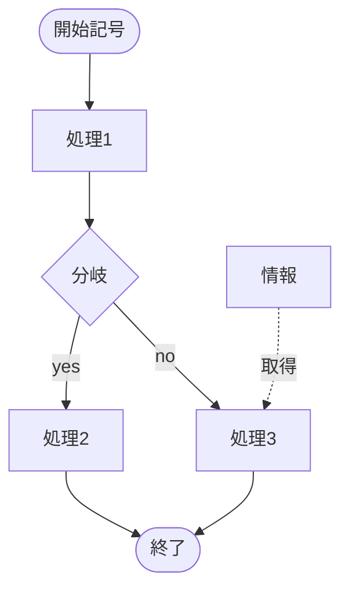

# ドキュメント

説明変数を使う。  
なるべく受動態を使わない。

## 設計書
設計書からテストを作成できるように書く。  
画面名や機能名を適切に使う。  
以下は見出しを分けて書く。
* UI
* 制御・処理

## テストケース
### 準備
テスト環境とテスト観点を明らかにする。  

### 作成
テスト観点ごとに作成する。  
前提・操作・期待値を明らかにする。

## mermaid
テキストでフローチャートなどを表現できるJSのライブラリ、以下はサンプル

