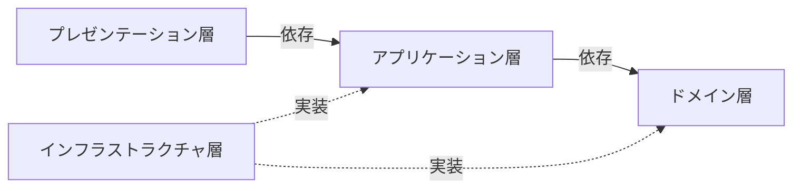
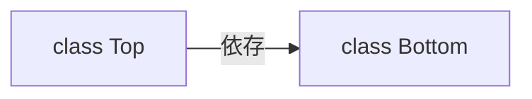
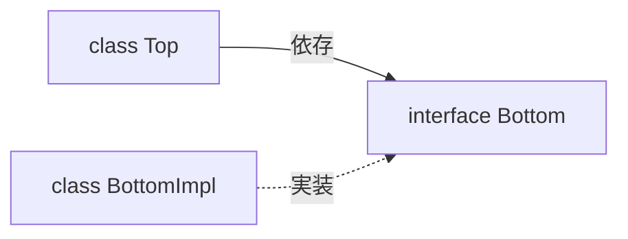

# プログラミング

## DI（依存性の注入）
関心の分離を行い、疎結合なプログラムの実現を目的にしている

## レイヤードアーキテクチャー
依存性逆転の原則を適用したバージョン。  
プレゼンテーション層はアプリケーション層、アプリケーション層はドメイン層のように、1つ下の層の呼び出しのみ許可されている。



### プレゼンテーション層
入力チェックも含めた、入出力を実現する。  
アプリケーション層のユースケースの呼び出しをする。  
HTTPセッションを直接操作していいのはこの層のみ。  

### アプリケーション層
ロジック（分岐や計算）を持たず、ユースケースと認証・認可を実現する。  
ドメイン層のビジネスロジックの呼び出しをする。  
また、データベースのトランザクションの管理もこの層の責務である。

### ドメイン層
ビジネスロジックを実現する。  
永続化や再構築に依存してしまうため、ドメイン層でDDDのリポジトリを扱うのは好ましくない。

### インフラストラクチャ層
アプリケーション層やドメイン層のインターフェースの実装する。  
外部サービスへのアクセスの実装などがされる。  
データベースのトランザクションを管理することがあるが、あくまで補助的。アプリケーション層でユースケースごとにトランザクションを管理する必要がある。

## CQRS（コマンドクエリ責務分離）
Command Query Responsibility Segregationの略。  
コマンドは永続化のことであり、クエリは参照のことである。  
レイヤードアーキテクチャと組み合わせることがある。

## SOLID原則
### 単一責任の原則
Single Responsibility。  
クラスが持つ責任を1つにすること。

### オープン・クローズドの原則
クラスを拡張にはオープンにし、変更にはクローズドにすること。  
既存のコードを直接修正することなく、新しい機能や振る舞いを追加できるように設計すること。

### リスコフの置換原則
Liskov Substitution。  
親子関係のクラスがあるとき、プログラム上の親クラスのオブジェクトをすべて子クラスのオブジェクトに置き換えても、プログラムの特性が変わらないようにすること。

### インターフェイス分離の原則
Interface Segregation。  
不要なインターフェースの仕様を避けること。  
実装する必要がないメソッドがインターフェイスに定義されている場合は、インターフェースを適切に分割すること。

### DIP（依存性逆転の原則）
上位レベルのモジュールが下位レベルのモジュールに依存せず、どちらも抽象に依存していること。  
抽象は、実装の詳細に依存せず、実装の詳細が抽象に依存すること。  
  
身近なもので考えると理解しやすい。パソコンとキーボードを例にする。  
DIPを適用していない状態は、パソコンが特定のキーボードに依存している状態である。  
このとき、パソコンを買い替えると、古いキーボードの利用ができなくなる可能性がある。  
DIPを適用している状態は、パソコンとキーボードがUSBなどの規格に依存している状態である。  

#### 上位レベルのモジュールが下位レベルのモジュールに依存している状態
下位レベルのモジュールの変更が、上位レベルのモジュールに影響を与えることになる。  


#### 依存性逆転の原則を適用した状態
下位レベルのモジュールに変更があっても、上位レベルのモジュールへの影響はない。


## DRY原則
Don't Repeat Yourselfの略。  
開発において情報を重複させないこと。

## YAGNI原則
余計な機能を実装せず、必要になってから実装すること。

## KISS原則
Keep It Simple, Stupidの略。  
複雑さを避け、シンプルな設計・実装を心がけること。  
シンプルなコードは理解しやすく、バグも少なく、保守も容易になる。

## ビジネス例外とシステム例外
ビジネス例外とは業務ロジック上で想定される例外のこと。  
アプリケーションの正常な制御フローとして扱われる。  
システム例外とはアプリケーションの正常動作が困難になる例外のこと。  
ネットワーク障害やデータベース接続エラーが該当する。  
Javaの場合、ビジネス例外はRuntimeException、システム例外はExceptionを継承することが多い。

## デメテルの法則
尋ねるな、命じよ。Tell Don't Ask.  
オブジェクトからデータを取り出し手続き的に処理を組み立てるのではなく、オブジェクトに処理を命じること。

## 品詞
メソッド名、変数名などは品詞に注意して名付ける。  
メソッドの呼び出し元で自然な英語になってることが理想。

## 変数名
否定形は使わない

## TODOコメント
```
// TODO: ここにコメント
```

## モジュラーモノリス
モノリシックアーキテクチャとマイクロサービスアーキテクチャの中間に位置するアーキテクチャ。  
モノリシックアーキテクチャのシンプルなデプロイ・運用と、マイクロサービスアーキテクチャのモジュール性による開発効率・保守性の向上を両立する。

### モノリシックアーキテクチャ
すべての機能が単一のプログラムにまとめられているアーキテクチャ。

### マイクロサービスアーキテクチャ
機能ごとに独立した小さなサービスを連携させるアーキテクチャ.

## ポーティング
ソフトウェアやアプリケーションを異なるプラットフォームや環境で動作するように移植すること。  
OSの移行、プログラミング言語の変更、ハードウェアアーキテクチャの変更などが含まれる。

## polyglot
複数のプログラミング言語で解釈可能な1つのファイルのこと。  
※広義には、複数のプログラミング言語を使用してシステムを構築する開発アプローチを指すこともある。

## REPL
Read-Eval-Print Loopの略。  
対話的にコードを実行できる開発環境のこと。  
コードを入力(Read)し、評価(Eval)し、結果を出力(Print)するループを繰り返す。

## i18nとl10n
### i18n
internationalizationの略。ソフトウェアを多言語・多地域に対応させるための設計・実装のこと。

### l10n
localizationの略。特定の言語や地域に合わせてソフトウェアを適応させる作業のこと。

## メモリ
### ヒープ
動的にメモリを割り当てる領域。プログラムの実行時に必要なメモリサイズが決まるデータ（オブジェクトなど）を格納する。  
メモリ管理が必要で、不要になったメモリは解放する必要がある（ガベージコレクションなし言語の場合）。  
ヒープから割り当てたメモリは手動で解放できるため、プログラム実行中に割り当てサイズを変更できる。

### スタック
関数呼び出しやローカル変数を格納する領域。メモリサイズが固定で、LIFO（後入先出）で管理される。  
関数から戻ると自動的にメモリが解放される。  
スタックはサイズが制限されているため、深い再帰呼び出しや大量のローカル変数はスタックオーバーフローを引き起こす。

## Java
### スレッドダンプの取り方
実行中のJavaアプリケーションのスレッド状態を取得する方法。  
デッドロックやパフォーマンス問題の解析に使用される。  
主な取得方法:
* `jstack <pid>` - プロセスIDを指定してスレッドダンプを取得
* `kill -3 <pid>` - Unix/Linuxでシグナルを送信して取得
