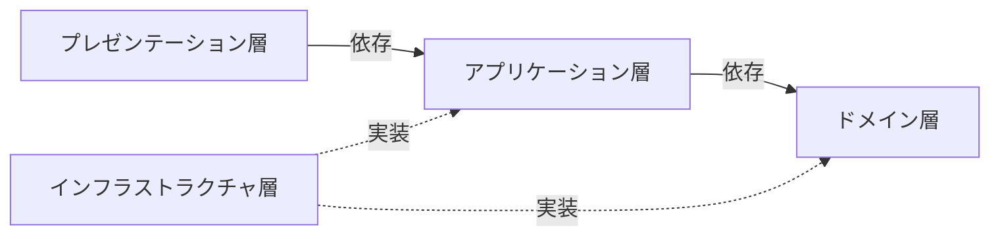

# プログラミング

## レイヤードアーキテクチャー
依存性逆転の原則を適用したバージョン。  
プレゼンテーション層はアプリケーション層、アプリケーション層はドメイン層のように、1つ下の層の呼び出しのみ許可されている。

### プレゼンテーション層
入力チェックも含めた、入出力を実現する。  
アプリケーション層のユースケースの呼び出しをする。  
HTTPセッションを直接操作していいのはこの層のみ。  

### アプリケーション層
ロジック（分岐や計算）を持たず、ユースケースと認証・認可を実現する。  
ドメイン層のビジネスロジックの呼び出しをする。  
また、データベースのトランザクションの管理もこの層の責務である。

### ドメイン層
ビジネスロジックを実現する。  
永続化や再構築に依存してしまうため、ドメイン層でDDDのリポジトリを扱うのは好ましくない。

### インフラストラクチャ層
アプリケーション層やドメイン層のインターフェースの実装する。  
外部サービスへのアクセスの実装などがされる。  
データベースのトランザクションを管理することがあるが、あくまで補助的。アプリケーション層でユースケースごとにトランザクションを管理する必要がある。

## ポーティング
ソフトウェアやアプリケーションを異なるプラットフォームや環境で動作するように移植すること。  
OSの移行、プログラミング言語の変更、ハードウェアアーキテクチャの変更などが含まれる。

## polyglot
複数のプログラミング言語で解釈可能な1つのファイルのこと。  
※広義には、複数のプログラミング言語を使用してシステムを構築する開発アプローチを指すこともある。

## REPL
Read-Eval-Print Loopの略。  
対話的にコードを実行できる開発環境のこと。  
コードを入力(Read)し、評価(Eval)し、結果を出力(Print)するループを繰り返す。

