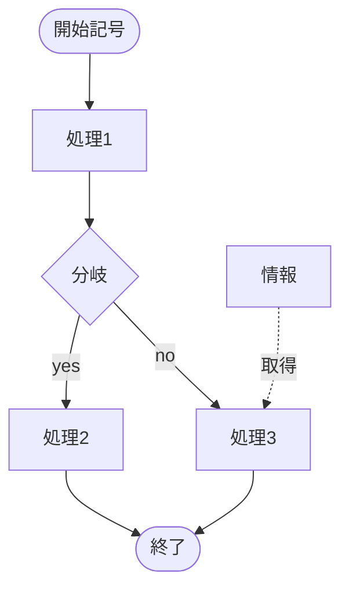

# ドキュメント
説明変数を使う

## 設計書
* 設計書からテストを作成できるように書く
* 画面名や機能名を使う
* 以下は見出しを分けて書く
    * UI
    * 制御・処理

## テストケース
### 準備
* テスト環境を明らかにする
* テスト観点を明らかにする
    * 設計書の見出し毎に作る

### 作成
* テスト観点ごとに作成する
* 前提を明らかにする（〜こと）
* 操作を明らかにする（〜する）
* 期待値を明らかにする（〜こと）

## mermaid
テキストでフローチャートなどを表現できるJSのライブラリ、以下はサンプル

