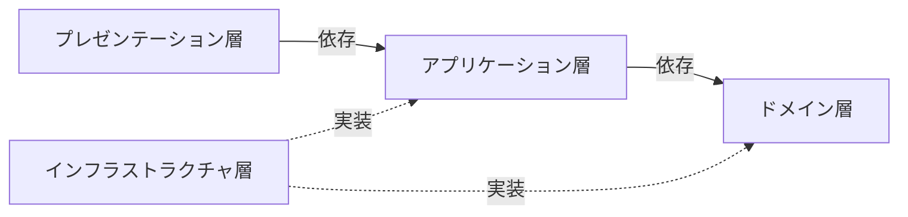
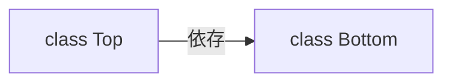
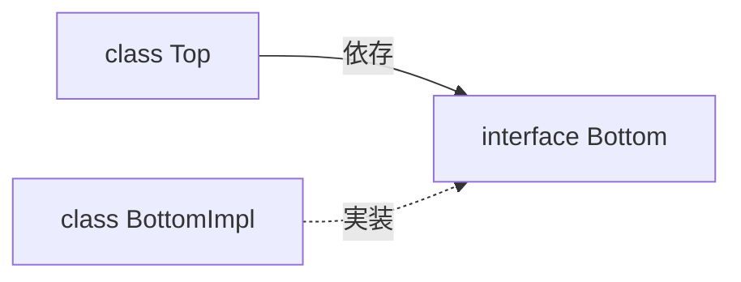

# プログラミング
## OOP（オブジェクト指向プログラミング）
* 抽象化
* カプセル化
* 継承
* ポリモーフィズム

## DDD（ドメイン駆動設計）
### ドメイン
プログラムを適用する対象となる領域のこと。  
ソフトウェア開発を行うということは、直面している問題があるということ。直面している問題を解決するには、ドメインに向き合う必要がある。

### ドメインモデル
ドメインの概念をモデリングして、作られたモデルのこと。  
モデルとは、現実の事象や概念を抽象化した知識のことである。抽象化する作業をモデリングと呼ぶ。  
ドメインモデルは抽象化した知識であるため、問題を解決する力を持っていない。

### ドメインオブジェクト
ドメインモデルを、動作するモジュールとして表現したもの。  
ドメインオブジェクトになることで、問題を解決する力を持つ。  

### Value Object（値オブジェクト）
* ドメインオブジェクトの一種
* 一意性を持たない
* 等価性によって比較される
* 不変である
* 交換が可能である

### Entity
* ドメインオブジェクトの一種
* 一意性を持つ
* 同一性によって比較される
* 可変である

### Domain Service
* ドメインオブジェクトに実装すると、不自然になるふるまいを実装するオブジェクトのこと
    * 「不自然になるふるまい」は、ドメインオブジェクトを横断する操作に多く見られる
* ドメインサービスはドメインオブジェクトと異なり、自身のふるまいを変更するインスタンス特有の状態を持たない

### ドメインモデル貧血症
ドメインオブジェクトに記述されるべき知識やふるまいが、ドメインサービスやアプリケーションサービスに記述されている状態のこと。  
ドメインモデル貧血症が起きると、オブジェクト指向プログラミングから離れ、手続き型プログラミングを助長する状態となる。

### Repository
* Entityの永続化

## DI（依存性の注入）
関心の分離を行い、疎結合なプログラムの実現を目的にしている

## レイヤードアーキテクチャー
依存性逆転の原則やCQRSを適用したバージョン  



### プレゼンテーション層
* 入出力を実現する（入力チェックも含める）
* アプリケーション層のユースケースの呼び出しをする

### アプリケーション層
* ユースケースを実現する
    * ロジック（分岐や計算）を持たない
* ドメイン層のビジネスロジックの呼び出しをする
* 参照のインターフェースがある
* 認証・認可を実現する

### ドメイン層
* ビジネスロジックを実現する
* 永続化のインターフェースがある

### インフラストラクチャ層
* アプリケーション層やドメイン層のインターフェースの実装する
    * 永続化を実現する
    * 参照を実現する

## DIP（依存性逆転の原則）
上位レベルのモジュールが下位レベルのモジュールに依存せず、どちらも抽象に依存していること。  
抽象は、実装の詳細に依存せず、実装の詳細が抽象に依存すること。  
  
身近なもので考えると理解しやすい。パソコンとキーボードを例にする。  
DIPを適用していない状態は、パソコンが特定のキーボードに依存している状態である。  
このとき、パソコンを買い替えると、古いキーボードの利用ができなくなる可能性がある。  
DIPを適用している状態は、パソコンとキーボードがUSBなどの規格に依存している状態である。  

### 上位レベルのモジュールが下位レベルのモジュールに依存している状態
下位レベルのモジュールの変更が、上位レベルのモジュールに影響を与えることになる。  


### 依存性逆転の原則を適用した状態
下位レベルのモジュールに変更があっても、上位レベルのモジュールへの影響はない。


## CQRS（コマンドクエリ責務分離）
* コマンドクエリ責務分離
* Command Query Responsibility Segregationの略
* コマンドは永続化のこと
* クエリは参照のこと

## DRY原則
* Don’t Repeat Yourselfの略
* 情報を重複させないこと

## YAGNI原則
余計な機能を実装せず、必要になってから実装すること

## 単一責任の原則
クラスが持つ責任を1つにすること

## 品詞
* メソッド名、変数名などは品詞に注意して名付ける

## TODOコメント
```
// TODO: ここにコメント
```