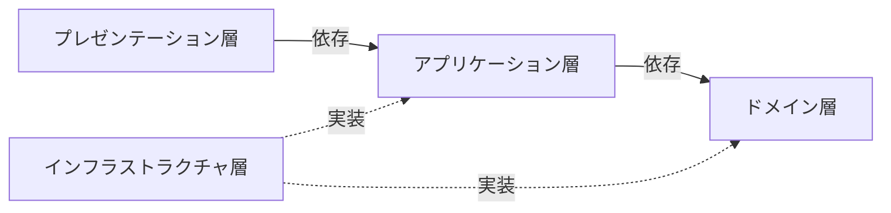

# プログラミング
## OOP
* 抽象化
* カプセル化
* 継承
* ポリモーフィズム

### Value Object
* 一意性を持たない
* イミュータブルである

### Entity
* 一意性を持つ

### Repository
* Entityの永続化

### DI
* 依存性の注入

## レイヤードアーキテクチャー

### プレゼンテーション層
* 入出力を実現する
* アプリケーション層のユースケースの呼び出しをする

### アプリケーション層
* ユースケースを実現する
    * ロジック（分岐や計算）を持たない
* ドメイン層のビジネスロジックの呼び出しをする
* 参照のインターフェースがある
* 認証・認可を実現する

### ドメイン層
* ビジネスロジックを実現する
* 永続化のインターフェースがある

### インフラストラクチャ層
* 永続化や参照を実現する
* アプリケーション層やドメイン層のインターフェースの実装する
    * 永続化を実現する
    * 参照を実現する

### CQRS
* コマンドクエリ責務分離
* Command Query Responsibility Segregationの略
* コマンドは永続化のこと
* クエリは参照のこと
* レイヤードアーキテクチャと直接関係ないが、組み合わせて利用可能

## 品詞
* メソッド名、変数名などは品詞に注意して名付ける
