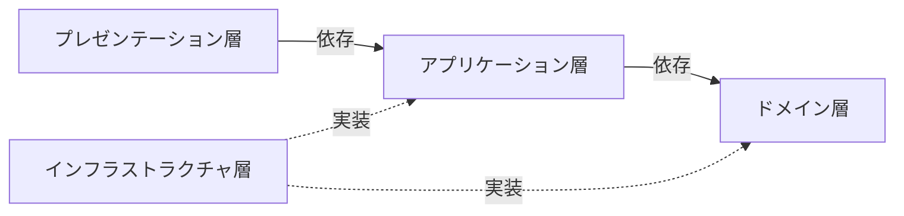
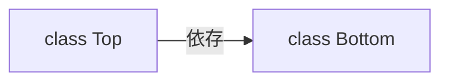
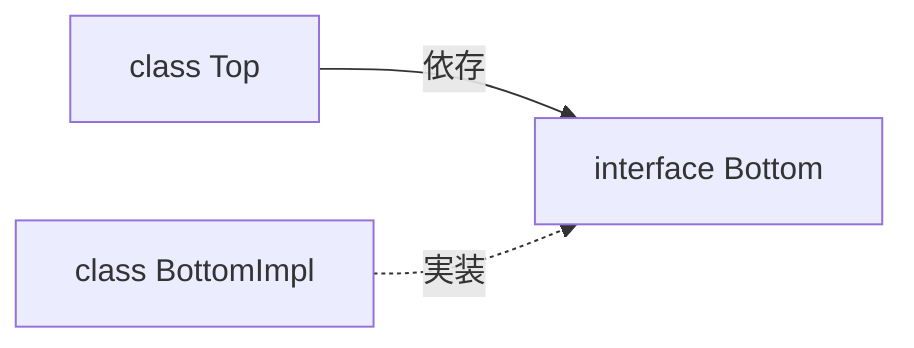

# プログラミング
## OOP（オブジェクト指向プログラミング）
以下の要素を持つ。
* 抽象化
* カプセル化
* 継承
* ポリモーフィズム

## DDD（ドメイン駆動設計）
### ドメイン
プログラムを適用する対象となる領域のこと。  
ソフトウェア開発を行うということは、直面している問題があるということ。直面している問題を解決するには、ドメインに向き合う必要がある。

### ドメインモデル
ドメインの概念をモデリングして、作られたモデルのこと。  
モデルとは、現実の事象や概念を抽象化した知識のことである。抽象化する作業をモデリングと呼ぶ。  
ドメインモデルは抽象化した知識であるため、問題を解決する力を持っていない。

### ドメインオブジェクト
ドメインモデルを、動作するモジュールとして表現したもの。  
ドメインオブジェクトになることで、問題を解決する力を持つ。  
DDDの場合はドメイン層に実装する。

### Value Object（値オブジェクト）
ドメインオブジェクトの一種であり、以下の特徴を持つ。
* 一意性を持たない
* 等価性によって比較される
* 不変である
* 交換が可能である

### Entity
ドメインオブジェクトの一種であり、以下の特徴を持つ。
* 一意性を持つ
* 同一性によって比較される
* 可変である
* ライフサイクルがある

### Domain Service
ドメインオブジェクトに実装すると、不自然になるふるまいを実装するオブジェクトのこと。  
「不自然になるふるまい」は、ドメインオブジェクトを横断する操作に多く見られる。  
ドメインサービスはドメインオブジェクトと異なり、自身のふるまいを変更するインスタンス特有の状態を持たない。  
DDDの場合はドメイン層に実装する。

### ドメインモデル貧血症
ドメインオブジェクトに記述されるべき知識やふるまいが、ドメインサービスやアプリケーションサービスに記述されている状態のこと。  
ドメインモデル貧血症が起きると、オブジェクト指向プログラミングから離れ、手続き型プログラミングを助長する状態となる。

### Repository
ドメインオブジェクトの永続化や再構築を行う。  
DDDの場合はドメイン層にインターフェース、インフラストラクチャ層に実装を置く。

### アプリケーションサービス
ユースケースを実現するオブジェクトのこと。  
ドメインに関する知識はここに書かず、ドメインオブジェクトやドメインサービスに書く。  
アプリケーションサービスは、自身の振る舞いを変更するインスタンス特有の状態を持たない。  
DDDの場合はアプリケーション層に実装する。

### ファクトリ
オブジェクトの生成処理を担当するオブジェクトやメソッドのこと。  
本来にコンストラクタの仕事だが、複雑な処理になる場合はそれ専用のオブジェクトにするのが好ましい。  
ファクトリを使う動機付けとして以下を挙げられる
* オブジェクトの生成処理内で、データベースにアクセスしたい
* オブジェクトの生成処理内で、他のオブジェクトを生成する必要がある

## DI（依存性の注入）
関心の分離を行い、疎結合なプログラムの実現を目的にしている

## レイヤードアーキテクチャー
依存性逆転の原則やCQRSを適用したバージョン  



### プレゼンテーション層
入力チェックも含めた、入出力を実現する。  
アプリケーション層のユースケースの呼び出しをする。  
HTTPセッションを直接操作していいのはこの層のみ。  

### アプリケーション層
ロジック（分岐や計算）を持たず、ユースケースと認証・認可を実現する。  
ドメイン層のビジネスロジックの呼び出しをする。  
また、データベースのトランザクションの管理もこの層の責務である。

### ドメイン層
ビジネスロジックを実現する。

### インフラストラクチャ層
アプリケーション層やドメイン層のインターフェースの実装する。  
外部サービスへのアクセスの実装などがされる。  
データベースのトランザクションを管理することがあるが、あくまで補助的。アプリケーション層でユースケースごとにトランザクションを管理する必要がある。

## DIP（依存性逆転の原則）
上位レベルのモジュールが下位レベルのモジュールに依存せず、どちらも抽象に依存していること。  
抽象は、実装の詳細に依存せず、実装の詳細が抽象に依存すること。  
  
身近なもので考えると理解しやすい。パソコンとキーボードを例にする。  
DIPを適用していない状態は、パソコンが特定のキーボードに依存している状態である。  
このとき、パソコンを買い替えると、古いキーボードの利用ができなくなる可能性がある。  
DIPを適用している状態は、パソコンとキーボードがUSBなどの規格に依存している状態である。  

### 上位レベルのモジュールが下位レベルのモジュールに依存している状態
下位レベルのモジュールの変更が、上位レベルのモジュールに影響を与えることになる。  


### 依存性逆転の原則を適用した状態
下位レベルのモジュールに変更があっても、上位レベルのモジュールへの影響はない。


## CQRS（コマンドクエリ責務分離）
Command Query Responsibility Segregationの略。  
コマンドは永続化のことであり、クエリは参照のことである。  
レイヤードアーキテクチャと組み合わせることがある。

## DRY原則
Don’t Repeat Yourselfの略。  
開発において情報を重複させないこと。

## YAGNI原則
余計な機能を実装せず、必要になってから実装すること。

## 単一責任の原則
クラスが持つ責任を1つにすること。

## 品詞
メソッド名、変数名などは品詞に注意して名付ける。

## TODOコメント
```
// TODO: ここにコメント
```