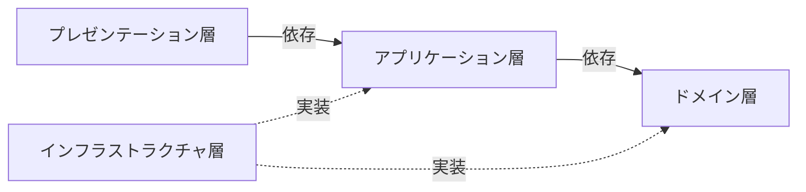
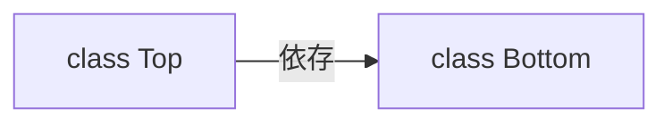
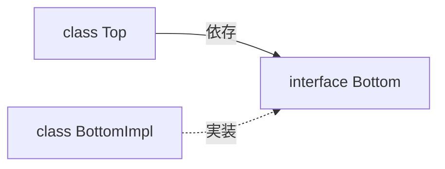

# プログラミング
## OOP
* 抽象化
* カプセル化
* 継承
* ポリモーフィズム

### Value Object
* 一意性を持たない
* イミュータブルである

### Entity
* 一意性を持つ

### Repository
* Entityの永続化

### DI
* 依存性の注入

## レイヤードアーキテクチャー
依存性逆転の原則やCQRSを適用したバージョン  

### プレゼンテーション層
* 入出力を実現する（入力チェックも含める）
* アプリケーション層のユースケースの呼び出しをする

### アプリケーション層
* ユースケースを実現する
    * ロジック（分岐や計算）を持たない
* ドメイン層のビジネスロジックの呼び出しをする
* 参照のインターフェースがある
* 認証・認可を実現する

### ドメイン層
* ビジネスロジックを実現する
* 永続化のインターフェースがある

### インフラストラクチャ層
* アプリケーション層やドメイン層のインターフェースの実装する
    * 永続化を実現する
    * 参照を実現する

## 依存性逆転の原則
上位レベルのモジュールが下位レベルのモジュールに依存していないこと。  
依存している場合、下位レベルのモジュールの変更が、上位レベルのモジュールに影響を与えることになる。

### 上位レベルのモジュールが下位レベルのモジュールに依存している状態

### 依存性逆転の原則を適用した状態
上位レベルのモジュールは下位レベルのモジュールのインターフェースに依存させる。  
こうすることで、下位レベルのモジュールに変更があっても、上位レベルのモジュールへの影響はない。

## CQRS
* コマンドクエリ責務分離
* Command Query Responsibility Segregationの略
* コマンドは永続化のこと
* クエリは参照のこと

## 品詞
* メソッド名、変数名などは品詞に注意して名付ける
