# Git
## Git for Windows
### アンインストール手順
1. `コントロールパネル -> プログラムと機能`から`Git`をアンインストールする
1. 下記ディレクトリを削除する
    * `C:\Program Files\Git`
    * `C:\Users\(ユーザ名)\.gitconfig`

### インストール手順
1. 以下からインストーラをダウンロードし実行する  
    [Git for Windows公式](https://gitforwindows.org/)  
1. インストール先を設定する  
    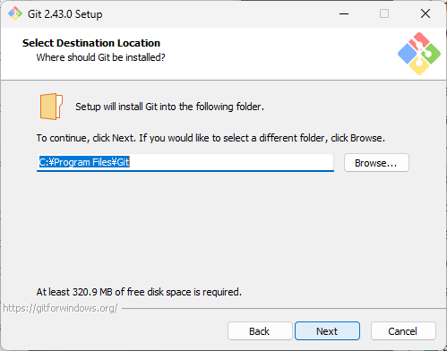  
1. コンポーネントは`Git LFS`のみチェックする  
    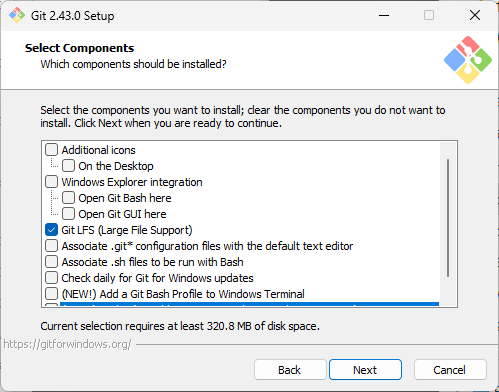  
1. スタートメニューでの表示名を設定する  
    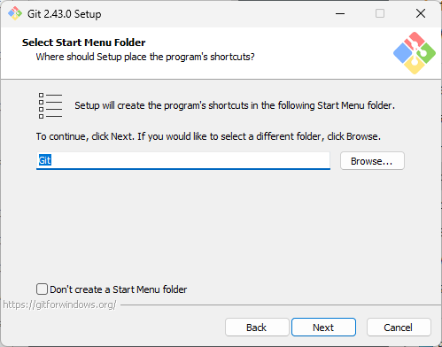  
1. エディターはデフォルトで進む  
    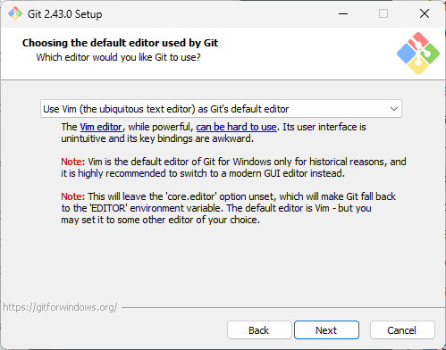  
1. 初期ブランチ名もデフォルトで進む  
    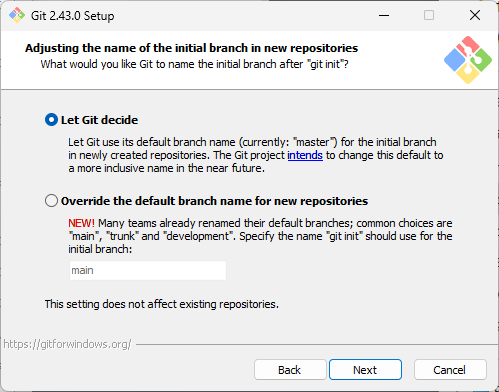  
1. 環境変数は`Use Git from Git Bash only`を選択する  
    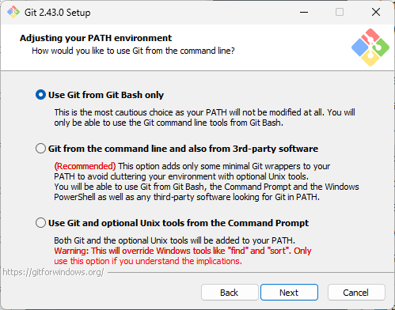  
1. SSHサーバは`Use external OpenSSH`を選択する  
      
1. `Use the OpenSSL library`を選択する  
    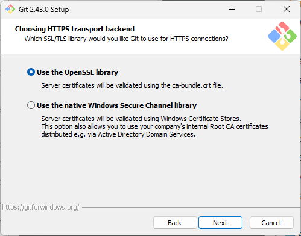  
1. 改行コード変換は`Checkout as-is, commit as-is`を選択する  
    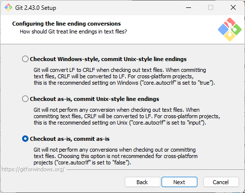  
1. `Use MinTTY`を選択する  
    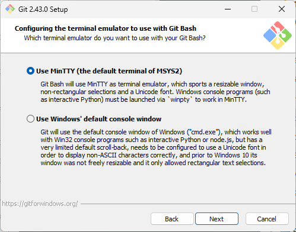  
1. `Fast-forward or merge`を選択する  
    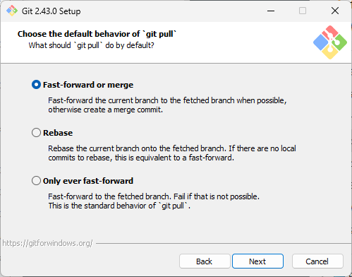  
1. `Git Credential Manager`を選択する  
    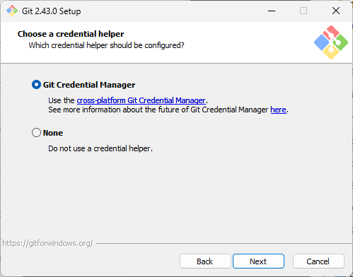  
1. 初期設定のまま進む  
    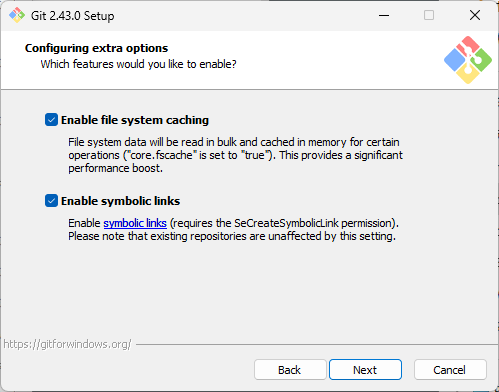  
1. 初期設定のまま進む  
    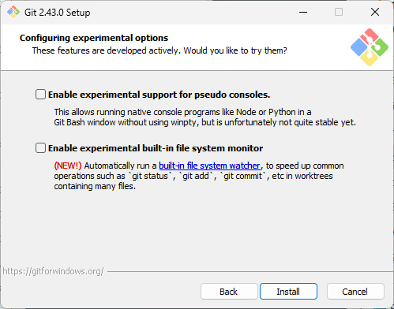  
1. インストール後、必要に応じて`git config`を実行する  

## TortoiseGit
### アンインストール手順
1. `コントロールパネル -> プログラムと機能`から`TortoiseGit`をアンインストールする

### インストール手順
1. 以下からインストーラをダウンロードし実行する  
    [TortoiseGit公式](https://tortoisegit.org/download/)  
1. すべてデフォルトのままインストールする
1. 何もないところで右クリックし、`TortoiseGit -> Setting`を開く
1. `Network -> SSH`を以下のように設定する  
    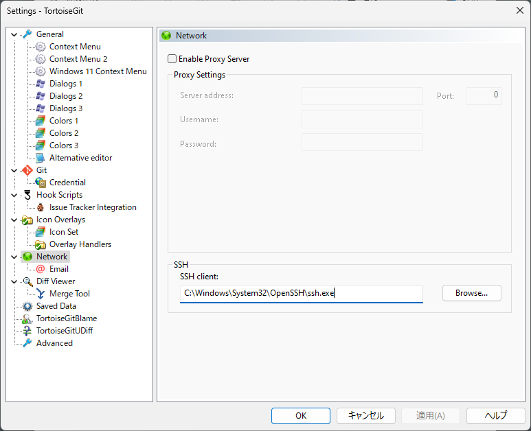  

## SSH鍵の設定
1. コマンドプロンプトで`ssh-keygen`を実行する
1. `C:\Users\(ユーザ名)\.ssh\id_rsa.pub`の中身をすべてコピーする
1. `GitHub`のユーザ設定でSSHKey（Authentication）を登録する

## GitHubのリリース
### 最新リリースのアセット取得方法
GitHubの最新リリースページへのリンクは以下の形式で取得できる:
* 最新リリースページ: `https://github.com/{owner}/{repo}/releases/latest`
* 特定のアセットの直接ダウンロード: `https://github.com/{owner}/{repo}/releases/latest/download/{asset-name}`

参考: [GitHub Docs - リリースへのリンク](https://docs.github.com/ja/repositories/releasing-projects-on-github/linking-to-releases)

GitHub APIを使った取得方法:
```bash
# 最新リリース情報の取得
curl -s https://api.github.com/repos/{owner}/{repo}/releases/latest

# jqを使って特定のアセットのダウンロードURLを取得
curl -s https://api.github.com/repos/{owner}/{repo}/releases/latest \
  | jq -r '.assets[] | select(.name | contains("linux-amd64")) | .browser_download_url'
```
